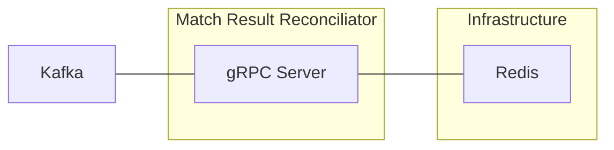

# extend-match-result-reconciliator



`AccelByte Gaming Services` (AGS) capabilities can be enhanced using 
`Extend Service Extension` apps. This repository provides a match result 
reconciliator service that receives match results from the collector service via Kafka,
and stores them in AccelByte CloudSave and Statistics services.

## Overview

This repository provides a project template for a match result reconciliator system 
written in `Go`. It includes two main services:

1. **Match Result Collector**: Receives match results via gRPC/HTTP API and publishes them to Kafka 
2. **Reconciliator**: Consumes match results from Kafka, reconciles discrepancies, and stores final results in AccelByte services (this service)

The system includes built-in instrumentation for observability, ensuring that 
metrics, traces, and logs are available upon deployment.

## Project Structure

The app consists of Reconciliator Service with shared components for protobuf definitions and common utilities.

```shell
.
├── main.go                          # App entry point
├── pkg
│   ├── common/                      # Shared utilities (auth, gateway, logging, etc.)
│   ├── pb/                          # gRPC stubs generated from protobuf
│   ├── proto/
│   │   └── service.proto          # gRPC service definitions
│   └── service/
│       └── service.go               # gRPC server implementation
└── docs/                            # Additional documentation
```

## Prerequisites

1. Windows 11 WSL2 or Linux Ubuntu 22.04 or macOS 14+ with the following tools installed:

   a. **Go v1.20+**
      ```
      go version
      go version go1.20.0 ...
      ```

   b. **Docker (Docker Desktop 4.30+/Docker Engine v23.0+)**
      ```
      docker version
      ...
      Server: Docker Desktop
         Engine:
         Version:          24.0.5
      ...
      ```

   c. **Make**
      ```
      make --version
      GNU Make 4.3
      ...
      ```

2. **Access to AGS environment**

   a. **Base URL**: Your AccelByte Gaming Services environment URL
      - Sample for AGS Shared Cloud: `https://spaceshooter.prod.gamingservices.accelbyte.io`
      - Sample for AGS Private Cloud: `https://dev.accelbyte.io`

   b. **Game Namespace**: [Create a Game Namespace](https://docs.accelbyte.io/gaming-services/services/access/reference/namespaces/manage-your-namespaces/) if you don't have one yet.

   c. **OAuth Client**: [Create an OAuth Client](https://docs.accelbyte.io/gaming-services/services/access/authorization/manage-access-control-for-applications/#create-an-iam-client) with confidential client type with the following permissions. Keep the `Client ID` and `Client Secret`.

      - For AGS Private Cloud customers:
        - `NAMESPACE:{namespace}:SESSION:GAME [Read]` - Required for reading match game session data
        - `ADMIN:NAMESPACE:{namespace}:USER:*:CLOUDSAVE:RECORD [Read, Update]` - Required for reading and updating player records in CloudSave
        - `ADMIN:NAMESPACE:{namespace}:USER:*:STATITEM [Update]` - Required for updating player statistics
      - For AGS Shared Cloud customers:
         - Session -> Game Session (Read)
         - Cloud Save -> Player Records (Read, Update)
         - Statistics -> User’s Statistics Value (Update)

3. Collector service setup and running.

## Setup

To run this app, follow these setup steps:

1. **Create environment configuration**

   Copy the template configuration file:
   ```bash
   cp .env.template .env
   ```

2. **Configure environment variables**

   Fill in the required environment variables in `.env` file:

   ```
   AB_BASE_URL='https://test.accelbyte.io'    # Your environment's domain Base URL
   AB_CLIENT_ID='xxxxxxxxxx'                  # Client ID from Prerequisites
   AB_CLIENT_SECRET='xxxxxxxxxx'              # Client Secret from Prerequisites  
   AB_NAMESPACE='xxxxxxxxxx'                  # Namespace ID from Prerequisites
   PLUGIN_GRPC_SERVER_AUTH_ENABLED=true       # Enable or disable access token and permission validation
   BASE_PATH='/reconciliator'                 # The base path used for the app
   KAFKA_BROKERS='localhost:9092'             # Kafka broker addresses
   REDIS_ADDR=localhost:6379                  # Redis address
   ```

## Building

To build this app, use the following command:

```bash
make build
```

## Running

To (build and) run this app in a container, use the following command.

```shell
docker compose up --build
```

## Testing

### Test in Local Development Environment

This app can be tested locally through the Swagger UI.

1. Run the collector service.

2. Run this app by using the command below.

   ```shell
   docker compose up --build
   ```

3. Send match result through collector service. The demo postman collection is provided in the collector repo.
   Run all the steps in the Extend Match Result Demo collection.

4. To ensure that the Reconciliator service actually stores the final result:

   - Ensure that player stats are updated in step `60-check-player-stats`
   - Ensure that new history is added to player Cloudsave in step `70-check-player-cloudsave`

### Test Observability

To be able to see the how the observability works in this template project in
local development environment, there are few things that need be setup before 
performing test.

1. Uncomment loki logging driver in [docker-compose.yaml](docker-compose.yaml)

   ```
    # logging:
    #   driver: loki
    #   options:
    #     loki-url: http://host.docker.internal:3100/loki/api/v1/push
    #     mode: non-blocking
    #     max-buffer-size: 4m
    #     loki-retries: "3"
   ```

   > :warning: **Make sure to install docker loki plugin beforehand**: Otherwise,
   this app will not be able to run. This is required so that container 
   logs can flow to the `loki` service within `grpc-plugin-dependencies` stack. 
   Use this command to install docker loki plugin: 
   `docker plugin install grafana/loki-docker-driver:latest --alias loki --grant-all-permissions`.

2. Clone and run [grpc-plugin-dependencies](https://github.com/AccelByte/grpc-plugin-dependencies) stack alongside this app. After this, Grafana 
will be accessible at http://localhost:3000.

   ```
   git clone https://github.com/AccelByte/grpc-plugin-dependencies.git
   cd grpc-plugin-dependencies
   docker compose up
   ```

   > :exclamation: More information about [grpc-plugin-dependencies](https://github.com/AccelByte/grpc-plugin-dependencies) is available [here](https://github.com/AccelByte/grpc-plugin-dependencies/blob/main/README.md).

3. Perform testing. For example, by following [Test in Local Development Environment](#test-in-local-development-environment).

## Deploying

After completing testing, the next step is to deploy your app to `AccelByte Gaming Services`.

1. **Create an Extend Service Extension app**

   If you do not already have one, create a new [Extend Service Extension App](https://docs.accelbyte.io/gaming-services/services/extend/service-extension/getting-started-service-extension/#create-the-extend-app).

   On the **App Detail** page, take note of the following values.
   - `Namespace`
   - `App Name`

2. **Build and Push the Container Image**

   Use [extend-helper-cli](https://github.com/AccelByte/extend-helper-cli) to build and upload the container image.

   ```
   extend-helper-cli image-upload --login --namespace <namespace> --app <app-name> --image-tag v0.0.1
   ```

   > :warning: Run this command from your project directory. If you are in a different directory, add the `--work-dir <project-dir>` option to specify the correct path.

3. **Deploy the Image**
   
   On the **App Detail** page:
   - Click **Image Version History**
   - Select the image you just pushed
   - Click **Deploy Image**

4. **Set Environment Variables**

   On the **App Detail** page:
   - Scroll to **Environment Secret Configuration** section
   - Ensure that AB_CLIENT_ID and AB_CLIENT_SECRET are correct
   - Add KAFKA_USERNAME and KAFKA_PASSWORD secrets (contact us for the values)
   - Add KAFKA_BROKERS and REDIS_ADDR (contact us for the values)

## Next Step

Proceed by modifying this `Extend Service Extension` app template to implement your own custom logic. For more details, see [here](https://docs.accelbyte.io/gaming-services/services/extend/service-extension/customize-service-extension-app/).

